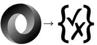

# json-schemify



Converts any JSON structure to a valid [JSON Schema](http://json-schema.org/) object.

[](https://www.npmjs.com/package/json-schemify)
[](https://travis-ci.org/tgreyuk/json-schemify)

## Getting started

### Installation

```js
npm install json-schemify --save-dev
```

### Usage

```js
const { schemify } = require('json-schemify');
```

or

```js
import { schemify } from 'json-schemify';
```

## API

The package exposes a single method:

### schemify(json, options)

```js
const schema = schemify(json, options);
```

#### Params

#### `json`

Any valid JSON.

#### `options`

Options object (all options are optional).

| Option | Description                      |
| ------ | -------------------------------- |
| id     | The $id property of the schema   |
| title  | The title property of the schema |

#### Returns

A valid JSON Schema Object (draft-07)

## Basic Example

This example returns a schema at the most basic level:

### JSON

```js
const json = {
  firstName: 'John',
  lastName: 'Doe',
  age: 21,
};
```

### API

```js
const schema = generate(json, {
  id: 'https://example.com/person.schema.json',
  title: 'Person',
});

console.log(schema);
```

### Result

```js
{
  $id: "https://example.com/person.schema.json",
  $schema: "http://json-schema.org/draft-07/schema#",
  title: "Person",
  type: "object",
  properties: {
    firstName: { "type": "string" },
    lastName: { "type": "string" },
    age: { "type": "integer" }
  }
}
```

## Writing to file?

If the JSON schema is required to be written to file [jsonfile](https://www.npmjs.com/package/jsonfile) does the job very well.
